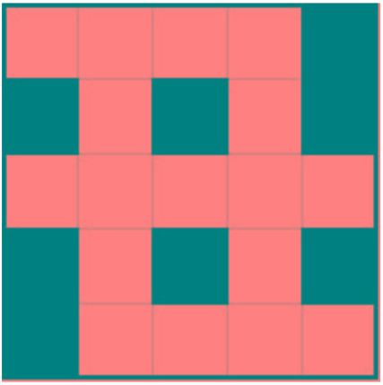
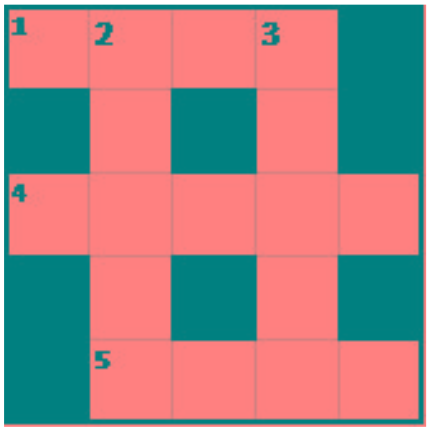

## Crossword puzzle solver with Hints

### Problem Description
A crossword puzzle is a square grid with black and blank squares, containing
clue numbers (according to a set of rules) on some of the squares. The puzzle is solved by obtaining the solutions to a set of clues corresponding to the clue numbers.
The solved puzzle has one letter in each of the blank square, which represent a sequence of letters (consisting of one or more words in English or occasionally other languages) running along the rows (called “Across”, or “A”) or along the columns (called “Down” or “D”). Each numbered square is the beginning of an Across solution or a Down solution. Some of the across and down solutions will intersect at a blank square, and if the solutions are consistent, both of them will have the same letter at the intersecting square.
In this problem, we will be having the specifications of the grid, and the
solutions in some random order. The problem is to number the grid appropriately, and associate the answers consistently with the clue numbers on the grid, both as Across solutions and as Down solutions, so that the intersecting blank squares have the same letter in both solutions.

#### Rules for Clue Numbering
The clue numbers are given sequentially going row wise (Row 1 first, and then row2 and so on) Only blank squares are given a clue number A blank square is given a clue number if either of the following conditions exist (only one number is given even if both the conditions are satisfied) It has a blank square to its right, and it has no blank square to its left (it has a black square to its left, or it is in the first column). This is the beginning of an Across solution with that number It has a blank square below it, and no blank square above it (it has a black square above it or it is in the first row). This is the beginning of a Down solution with that number

#### Input Format
The input consists of two parts, the grid part and the solution part
The first line of the grid part consists of a number, N, the size of the grid (the overall grid is N x N) squares. The next N lines correspond to the N rows of the grid. Each line is comma separated, and has number of pairs of numbers,
the first giving the position (column) of the beginning of a black square block, and the next giving the length of the block. If there are no black squares in a row, the pair “0,0” will be specified. For example, if a line contains “2,3,7,1,14,2”, columns 2,3,4 (a block of 3 starting with 2), 7 (a block of 1 starting with 7) and 14,15 (a block of 2 starting with 14) are black in the corresponding row.
The solution part of the input appears after the grid part. The first line of the solution part contains M, the number of solutions. The M subsequent lines consist of a sequence of letters corresponding to a solution for one of the Across and Down clues. All solutions will be in upper case (Capital letters)

#### Explanation

Example 1
Input
5
5,1
1,1,3,1,5,1
0,0
1,1,3,1,5,1
1,1
5
EVEN
ACNE
CALVE
PLEAS
EVADE

Solution:

N is 5, and the disposition of the black squares are given in the next 5 (N)
lines. The grid looks like this
 

M=5, and there are 5 (M) solutions.
If the grid is numbered according to the rules, the numbered grid loos like this.
Note that row 3 has no blanks, and the input line says “0,0” 

The solutions are fitted to the grid so that they are consistent, and the result is shown below. Note that this is consistent, because the letter at each intersecting blank square in the Across solution and the Down solution.

Based on this the output is given in clue number order. 1 Across is ACNE, and hence the first line of the output is 1,A,ACNE. The same logic gives all the remaining solutions.